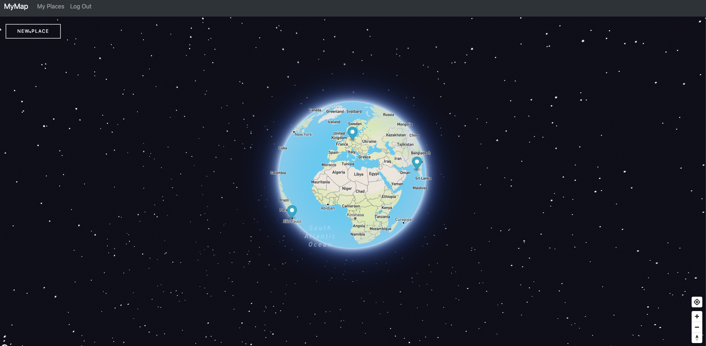
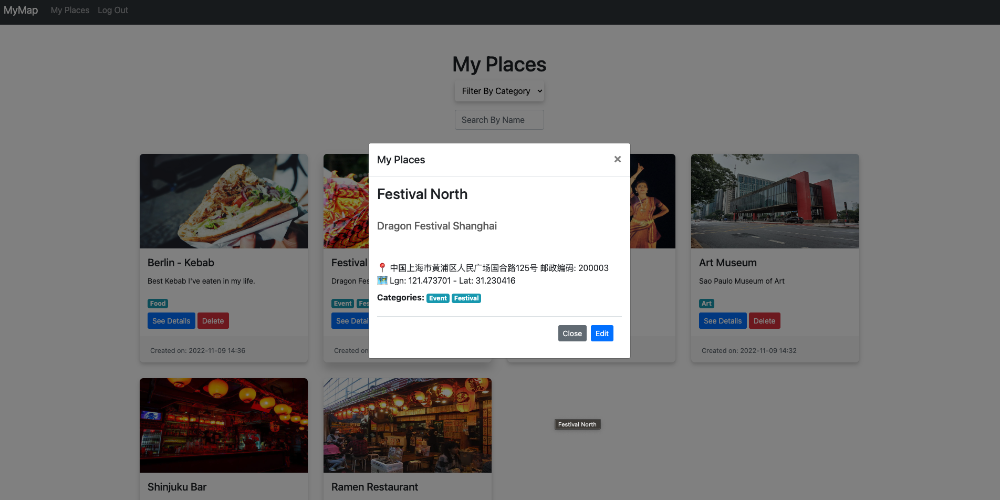

# CAPSTONE - MyPlaces
#### Demo video:  <https://youtu.be/_JwRIB4dgoU>


## Description

Welcome to MyPlaces!

This is my Final Project for the course CS50’s Web Programming with Python and JavaScript. It is built with  Django, Hmtl, Css, Javascript, Python & Bootsrap.

The main concept of this app is to enable the user to create a special memory for each place he visits and fall in love with. I came up with this idea as I had this problem: I found myself in a random but amazing place and when trying to remember where that place was located some time later, I couldn't find it. This could be for any type of place; Hidden restaurant, bar, hiking trails, beautiful place in the nature, and so on.

So I decided to build an app that display a map, and with a simple click, help you know your coordinate and address. You can then simply save this location by naming it, adding a description, an image, and categorize it so you can find it later when searching through all of your places created. 

## Distinctiveness and Complexity
I believe my project satisfies the distinctiveness and complexity requirements because it has nothing in common with the other course projects. 
In fact, in the course, we built:

* A Google search clone
* A project similar to wikipedia that enables us to create an article with a markdown system and edit it.
* A Bid auction website
* A SPA (single page app) - mail app
* A network App similar to tweeter in which we can create/like a post, edit our own post and follow/unfollow people.

My project is an interactive Globe Map on which you can locate yourself (if you authorize location on your device) and save this location as a memory. It is nowhere close to any of the other projects. This is for the distinctiveness.

About the complexity requirements, my project utilizes Django on the backend and Javascript on the frontend. It is also mobile responsive, as shown in the demo video.

### Pages:

#### 1. MyMap Page 

When logged in, you are redirected to this page. In here, you will see the Globe Map. You can locate yourself clicking on the location button at the right bottom. Then, you can click on the button "New Place" on the top left corner to save your current location if you want to. 

Once you submit the form to create your place, a pop up will be added dynamically to the map for your new place freshly created. On the pop up, the image, title and description will be displayed. You can either click on "see details" to get redirected to the MyPlace page to see your places and maybe, if your want to, edit it or delete these places. You can also click on delete if you made a mistake when creating a new place and desire to delete it and remove it immediately from the map without having to go to the MyPlace page. The dom will be updated and no reload will occur.





#### 2. Myplaces Page

On this page, you will find all of the places you created. You can search a place by category with the select menu called "Filter By Category", or by name with the "Search by Name" bar search. As mentionned above, you can see the details about any places by clicking on "See Details". You can edit any place by clicking on "Edit" or delete any place by clicking on "Delete". Everything is interactive and reactive, so everytime you will edit a place, or delete it, the dom will update and no reload will occur.




## File Structure

The main folder called Capstone contains 2 folders : 

The first one is our djangoproject called capstone as well: 

```python
capstone
 ┣ __pycache__
 ┃ ┣ __init__.cpython-310.pyc
 ┃ ┣ settings.cpython-310.pyc
 ┃ ┣ urls.cpython-310.pyc
 ┃ ┗ wsgi.cpython-310.pyc
 ┣ __init__.py
 ┣ asgi.py
 ┣ settings.py
 ┣ urls.py
 ┗ wsgi.py
```
Files modified in this folder and what they contain:

Settings.py:
All of the settings of our django project, our app installed and our custom configuration.

urls.py:
All of the path for our app, including the admin panel and our app called myplaces


The second one is our app called myplaces:
```python
 myplaces
 ┣ __pycache__
 ┃ ┣ __init__.cpython-310.pyc
 ┃ ┣ admin.cpython-310.pyc
 ┃ ┣ apps.cpython-310.pyc
 ┃ ┣ models.cpython-310.pyc
 ┃ ┣ serializers.cpython-310.pyc
 ┃ ┣ urls.cpython-310.pyc
 ┃ ┗ views.cpython-310.pyc
 ┣ migrations
 ┃ ┣ __pycache__
 ┃ ┃ ┣ 0001_initial.cpython-310.pyc
 ┃ ┃ ┗ __init__.cpython-310.pyc
 ┃ ┣ 0001_initial.py
 ┃ ┗ __init__.py
 ┣ static
 ┃ ┣ myplaces
 ┃ ┃ ┣ logos
 ┃ ┃ ┃ ┣ icon-marker.png
 ┃ ┃ ┃ ┗ question.png
 ┃ ┃ ┣ index.js
 ┃ ┃ ┣ map.js
 ┃ ┃ ┣ myplaces.js
 ┃ ┃ ┣ styles.css
 ┃ ┃ ┗ utils.js
 ┃ ┗ places_pictures
 ┃ ┃ ┣ default.png
 ┣ templates
 ┃ ┗ myplaces
 ┃ ┃ ┣ index.html
 ┃ ┃ ┣ layout.html
 ┃ ┃ ┣ login.html
 ┃ ┃ ┣ my_places.html
 ┃ ┃ ┗ register.html
 ┣ __init__.py
 ┣ admin.py
 ┣ apps.py
 ┣ models.py
 ┣ serializers.py
 ┣ tests.py
 ┣ urls.py
 ┗ views.py
```

### Files modified in this folder and what they contain:

### Folder migrations:
Contains every migrations we do everytime we bring a change to our models, database.

### Static Folder:

#### myplaces folder:
Contains a folder named logo in which we can find some logos, svg or image used in our project.

#### Index.js:
This file contains the function called submitNewPlace which enables us to create a new place and save it.

#### map.js:
This file contains the functions needed to run the map from the Mapbox Api and other functions to interact with the map, find our location, load all of the markers for each place we have created so far.

#### myplaces.js:
This file contais the functions that enable us to filter our places by category, search name, edit them and delete them. Functions that load all of our places when the page is loaded, or other functions that just add more interactivity to the page.

#### utils.js:
This js file contains functions we call in every pages. That's why it is called utils and is called in the layout.html file.

#### styles.css:
This is our stylesheet in which we write all of our CSS for the design of the app.

### Places_picture Folder:
This folder simply contains the photos/images uploaded for each place created.

### Template Folder:
This folder contains all of our html templates.

#### admin.py:
This is where we register our models into our admin panel.

#### apps.py: 
Config file for the app

#### models.py:
This file contains all of our models.

#### serializers.py:
This file contains all of our serialized models. We use the django rest framework to serialize our models. Serializers in Django REST Framework are responsible for converting objects into data types understandable by javascript and front-end frameworks. Serializers also provide deserialization, allowing parsed data to be converted back into complex types, after first validating the incoming data.

#### tests.py:
File in which we can write all of ou tests for our app.

#### urls.py:
This file contains all the urls created for our app myplaces.

#### views.py:
this file contains all of our views. In the Django framework, views are Python functions or classes that receive a web request and return a web response. The response can be a simple HTTP response, an HTML template response, or an HTTP redirect response that redirects a user to another page.


## Installation & How to run the project
In order to run the project, you need to install the dependencies found in the requirements.txt file. 

First you need to install Python if not done already: Click [Here](https://www.python.org/downloads/) to do so.

Then, run the following command to create a Virtual Environment:

```bash
# Create a virtual environment
$ python3 -m venv
```

### Activate your environment
You’ll need to use different syntax for activating the virtual environment depending on which operating system and command shell you’re using.

On Unix or MacOS, using the bash shell: source /path/to/venv/bin/activate<br>
On Unix or MacOS, using the csh shell: source /path/to/venv/bin/activate.csh<br>
On Unix or MacOS, using the fish shell: source /path/to/venv/bin/activate.fish<br>
On Windows using the Command Prompt: path\to\venv\Scripts\activate.bat<br>
On Windows using PowerShell: path\to\venv\Scripts\Activate.ps1<br>

```bash
# After your environment has been activated, install the dependencies
$ pip install -r requirements.txt
```

```bash
# After that, you might need to make a migrations for the DB
$ python manage.py makemigrations
```
```bash
# Migrate
$ python manage.py migrate
```

```bash
# Finally, run the django project using 
$ python manage.py runserver
```

## Don't forget your API Keys

To see the map appear and get all of the functionalities as shows as in the demo:
You will need to go to the map.js file which is located in myplaces/static/myplaces/map.js. 

At the top of the file, you need to provide:

* a Key for Mapbox in order to have the globe to appear - Grab a key [Here](https://docs.mapbox.com/) to do so. 
* A Google Api Key for the reverse geocoding incurring when we locate ourself. Grab a key [Here](https://console.cloud.google.com/) to do so

This will find our address based on the coordinates found with mapbox. 

## Comments
A big thanks to the whole Team of CS50 for providing courses which such a high quality.  


## Stay in touch

- Author - [Marcello](https://github.com/Marxi7)
